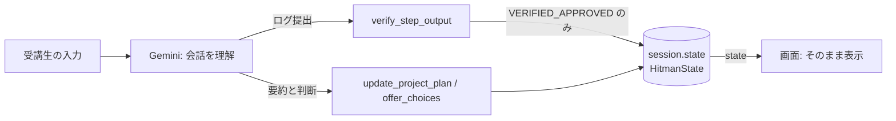

# HITMAN 研修フロー 修正の記録とロードマップ

対象: `almlog/ipp-ai-training-lab`（PR #1〜#4、2026-09-26〜27）
読んでほしい人: HITMAN の開発者・講師、そして **このリポジトリを変更する Antigravity（Gemini）**

この文書は次の4つをまとめたものです。

1. なぜ修正が必要だったか（根本原因）
2. PR #1〜#4 で何を、なぜ変えたか
3. これからのロードマップ
4. Antigravity に同じミスを繰り返させないための注意事項

> Antigravity へ: HITMAN（`hitman/` 配下）を変更する前に、必ず「4. Antigravity への注意事項」と `hitman/GEMINI.md` を読んでください。

---

## 1. なぜ修正が必要だったか

### 起きていた症状

- 研修モード「自作AIアプリ」のフローで、カードが固定の文面になり、受講生の相談内容に応えられない
- 同じカードが何度も出るループや、合格していないのに次のステップへ進む現象
- 表からは見えない不具合がありそう、という感触

### 根本原因は3つ

| 根本原因 | 何が起きていたか |
|---|---|
| **状態を LLM の文章から推測していた** | 現在ステップ・合否・コースが、画面（localStorage）、サーバのグローバル変数、ADK セッションの3か所にあった。画面は Gemini の返答文を正規表現で読んでステップを決めていた。案内文の中の「Wチェック承認」「修了認定」などを合格と誤認し、その推測でサーバ側を上書きしていた |
| **会話の判断を Python のキーワード分類が担っていた** | 企画相談で、受講生の発言をそのままツールに渡し、キーワードで「確定・相談中・コース」を決め、定型文を返していた。Gemini はその定型文を読み上げるだけになり、カードも返答候補も固定化した |
| **合格条件が「それらしい文字があるか」だった** | 企画書に `## ` があれば T-2 合格、URL があれば T-5・T-6 合格など。固定値を返すだけのダミー実装や、別の企画のサンプルの貼り付けでも合格できた |

さらに、開発者の環境（リポジトリ直下を Antigravity で開いている）と受講生の環境（2段下にクローンする）が違ったため、**受講生の環境ではスキルが一度も読み込まれていなかった**ことにも気づけていませんでした。

---

## 2. PR ごとの変更内容と理由

### PR #1: 研修の状態をサーバのセッションに一本化（ループ・誤進行・会話履歴消失）

**理由**: 状態が3か所にあり、互いに上書きし合っていたことがループと誤進行の原因だったため。

- 研修の状態は ADK の `session.state` にだけ置く。読み書きは `HitmanState` 経由
- ステップが進むのは `verify_step_output` の判定（VERIFIED_APPROVED）だけ。コースが変わるのは `select_training_course` だけ
- 画面は `/chat` が返す `state` をそのまま表示する。返答文の正規表現による推測を廃止
- 受講生（ブラウザ）ごとにセッションを分離。それまでは全員が `operator-01` で状態が混ざっていた
- 見つかった重大バグ
  - `get_session_sync` に必須引数が渡っておらず、**毎メッセージが新規セッション**だった。Gemini が会話履歴を見られない状態
  - `logger` が未定義で、503/429 のリトライが動いていなかった
  - 「選択中（折りたたむ）」ボタンが進捗をリセットしていた
  - リロードのたびに進捗を書き換える「自己治癒」処理が進捗を壊していた
- サーバ再起動でセッションが消えた場合は、画面の直近の状態から復元する（途中が抜けた合格は採用しない）

### PR #2: 受講生環境でスキルが読み込まれない問題（T-1 の配置変更・参照の整合・使用証跡）

**理由**: 実機で確認したところ、Antigravity はワークスペース直下の `.agents/skills/` しか読まないことがわかったため。

- 実機での確認結果

  | 確認内容 | 結果 |
  |---|---|
  | ワークスペース直下の `.agents/skills/<name>/SKILL.md` | 読み込まれる。`/` の候補に `name` で表示される |
  | 1段以上下の階層（例：`hitman/.agents/skills/`） | 同じ会話・新しい会話・再起動後、いずれでも読み込まれない |
  | 会話の途中で置いたスキル | その会話では使えない。新しい会話から有効 |

- T-1 で `.agents` をワークスペース直下へコピーし、**新しい会話で** `/ipp-skill-check` を実行して、その出力（`[skill:ipp-skill-check@v1]`）を提出する形に変更
- 存在しないスキルへの参照を整理（`google-agents-cli-adk-code-ja`、`gemini-multimodal-vision` など）
- `name` とフォルダ名の不一致を修正（`rag-engine-setup`、`memory-bank-setup`）
- 各スキルが使用証跡 `[skill:<name>@v1]` を出力するルールを追加

### PR #3: T-3 を「実際にエージェントを動かした結果」で判定

**理由**: 見本の成果物がダミー実装だったため。固定値を返すツール、エージェントを呼ばない `/chat`、固定値を確認するだけのテスト、という中身でも T-1〜T-6 をすべて通過していた。

- 新スキル `ipp-agent-smoke-test`: 受講生のエージェントに2つの質問を実際に投げ、ツールが呼ばれたか、質問によって応答が変わるか、ダミー実装（引数を無視して同じ結果を返す）でないかを記録する
- HITMAN は出力の生データ（`SMOKE_JSON`）から再判定し、`SMOKE_DIGEST` で書き換えを検知する
- 見本（コースA）を、実際に動く「障害ログ解析Bot」（`ipp-agent-workspace/log_analyzer_bot`）に作り直した
- 実機（Windows）の Gemini で合格を確認。その際、API キーの扱いを修正（`AQ.` で始まるキーは Vertex AI Express として扱う。キーは出力しない）

### PR #4: T-2 企画相談を Gemini 主導に。提出物を企画に紐づける。ログ注入に正常・異常パターン

**理由**: 固定カードの原因だったキーワード判定と定型文を外すため。さらに実機テストで「企画と関係ないサンプルの貼り付けで T-2・T-3 が合格する」ことが判明したため。

- 会話の理解は Gemini、ツールは記録と事実の提供に分担
  - `update_project_plan(idea_summary, status, course, agent_name)`: Gemini が要約と判断（相談中／確定）を渡す
  - `offer_choices(choices)`: 返答候補のボタンを Gemini が毎ターン作る。固定チップは廃止
- 提出物を「確定した企画」に紐づけ
  - T-2: 企画の確定が必須（コースBは不要）。企画書に確定したエージェント名がなければ不合格
  - T-2 合格時に受講生ごとの確認コード（例: `T3-5C588D`）を発行する。T-3 のコマンドに `--nonce` として入り、スモークテストの改ざん検知対象になる。サンプル・他人の出力・別フォルダの出力は不合格
- 🧪ログ注入に「正常（合格する想定）」「異常（不合格になる想定）」を用意
  - T-2（コースA）と T-3 は受講生の企画・確認コードに合わせてサーバで生成
  - Cloud Run では既定で無効（`HITMAN_DEMO_EVIDENCE=1` で有効化）。受講生がこのボタンで合格できないようにするため
- 異常パターンの検証で判定の穴を2つ修正
  - `git push` が rejected で失敗しても T-6 合格
  - `cat` がファイルなしで失敗しても T-2（コースB）合格

### 現在の合格条件（まとめ）

| ステップ | 合格に必要なもの |
|---|---|
| T-1 | 新しい会話で `/ipp-skill-check` を実行した出力（証跡 `[skill:ipp-skill-check@v1]`） |
| T-2 | コースA: 企画の確定＋確定したエージェント名を含む企画書。コースB: `hitman_spec.md` の内容 |
| T-3 | その受講生の確認コード付きで、企画どおりのフォルダで実行したスモークテストの PASS |
| T-4 | pytest が失敗なしで通った出力 |
| T-5 | Cloud Run のデプロイ成功（Service URL） |
| T-6 | GitHub への push 成功（rejected などの失敗がない） |

コマンド自体の失敗（`fatal: could not read`、`[rejected]`、`No such file or directory` など）が含まれるログは、URL やファイル名が含まれていても合格させません。

### 状態と判定の流れ

---

## 3. ロードマップ

### すぐやること（次の作業）

1. **本物の Gemini での再確認**: PR #4 の動作（企画相談 → 確定 → 企画書 → 確認コード付き T-3）を Antigravity と HITMAN の実機で確認する
2. **案A: T-3〜T-6 のカード内容を企画ごとに Gemini が作る**
   - ステップの骨格（T-1〜T-6）と合否判定は固定のまま、各ステップの作業内容・Antigravity 用プロンプトを企画に合わせて生成する
   - 理由: 現在は企画が違っても T-3 以降の手順がほぼ同じで、「ユーザーの入力次第で変わる」体験になっていないため
   - 全面的な動的化（案B）は、判定ゲートが崩れて過去と同じ誤合格が起きるため採用しない

### 近いうちにやること

3. **Cloud Run の再デプロイ**: 本番は PR #1 より前の古いコードのまま。セッションがメモリ上にあるため、インスタンスは1台にするか、セッションアフィニティを有効にする
4. **T-5 の構成の不一致を解消**: `build-agent-frontend` スキル（Agent Engine と A2A が前提）と T-5 の手順（`gcloud run deploy --source`）が食い違っている
5. **別研修の名残を削除**: ノベルティ申請、「Gemini World Tour」の固定タイトルなど
6. **古いスキルのコピーを整理**: 階層の深い場所に残っている、読み込まれないスキルのコピー
7. **`google-agents-cli-*-ja` スキルの扱いを決める**: 開発者の PC にはグローバルに入っているが、受講生の環境にはない。同梱するか、参照をやめるか
8. **`hitman/GEMINI.md` が Antigravity に自動で読まれるかを実機で確認する**: 新しい会話で「HITMAN で研修の現在ステップを保存する場所はどこにすべき？」と聞き、「session.state（HitmanState）」と答えるか

### その後

9. T-4 も実動作で判定する（テストの中身が固定値の確認だけになっていないか）
10. セッションの永続化（Firestore など）で、再起動やスケール時に状態を失わないようにする
11. 判定結果と使用スキルの記録を集計して、受講生がつまずくステップを数字で把握する

---

## 4. Antigravity への注意事項（同じミスを防ぐ）

ここに書いたことは、すべて実際に起きた不具合です。「なぜダメか」も書いてあるので、似た状況でも応用してください。
ルールに反する変更が必要だと判断した場合は、実装せずに理由を説明して人間に確認してください。

### 4-1. 状態を LLM の文章から推測しない

- **起きたこと**: 画面が Gemini の返答文を正規表現で読んでステップを決めていた。案内文中の「Wチェック承認」で合格扱いになり、進みすぎたり戻ったりした
- **守ること**
  - 研修の状態は `session.state`（`HitmanState`）にだけ置く
  - 画面はサーバが返す `state` を表示するだけにする
  - 返答文のキーワードで状態を決める処理を追加しない

### 4-2. モジュールのグローバル変数に受講生の状態を置かない

- **起きたこと**: `CURRENT_STEP` や `USER_IDEA` がプロセス全体で共有され、受講生どうしの状態が混ざった。テストも実行順によって失敗していた
- **守ること**: 受講生ごとに変わる値は、`get_training_sop` などでセッションの値から毎回計算する

### 4-3. 例外を握りつぶさない

- **起きたこと**: セッション取得の TypeError が `except` で握りつぶされ、毎回新規セッションになっていた。`logger` の未定義も気づかれなかった
- **守ること**: 例外は必ずログに出す。「動いているように見える」フォールバックで隠さない

### 4-4. 会話の判断をキーワード分類で作らない。ツールに定型文を返させない

- **起きたこと**: 受講生の発言をそのままツールに渡し、キーワードで分岐して定型文を返したため、Gemini が読み上げるだけになりカードが固定化した
- **守ること**
  - 判断（相談中か確定か、どのコースか）は Gemini が行い、ツールには結果を引数で渡す
  - ツールが返すのは記録内容と事実。返答候補は `offer_choices` で Gemini が毎回作る

### 4-5. 合格させるために判定を緩めない。「それらしい文字」で合格させない

- **起きたこと**
  - 見出しや URL があるだけで合格していた
  - ダミー実装、別企画のサンプル、失敗した `git push` でも合格した
- **守ること**
  - 合格条件は客観的な証跡（実行結果、スキルの出力、確認コード）にする
  - 提出物がその受講生の企画・環境のものかを確認する
  - 受講生が通れないときは、判定ではなく手順・案内・スキルを直す
  - 判定を変えたら、必ず「異常パターンが不合格になる」テストも書く

### 4-6. ダミー実装・スタブで「完成」にしない

- **起きたこと**: 見本の成果物が、固定値を返すツール、エージェントを呼ばない `/chat`、固定値を確認するだけのテストでできていた
- **守ること**
  - ツールは入力に応じて実際に処理する
  - `/chat` は必ずエージェント（LLM）を通す
  - テストは「入力が違えば結果も変わる」ことを確認する

### 4-7. 自分の環境で動いた＝受講生の環境で動く、と考えない

- **起きたこと**: 開発者はリポジトリ直下を開いていたためスキルが読み込まれ、受講生の配置（2段下）では読み込まれないことに気づけなかった
- **守ること**
  - 受講生の手順（クローン先、開くフォルダ、新しい会話）を、そのとおりに再現して確認する
  - 仕様がわからないことは推測で断定せず、実機で確かめる

### 4-8. スキルのルール

- 置き場所はワークスペース直下の `.agents/skills/<name>/SKILL.md`。新しい会話から有効
- frontmatter は正しい YAML にし、`name` をフォルダ名と一致させる（YAML の誤りで `record-demo` が読み込まれていなかった）
- 参照してよいのはリポジトリに実在するスキルだけ
- 各スキルは使用証跡 `[skill:<name>@v1]` を出力する

### 4-9. API キーを絶対にコマンド・ログ・チャットに書かない

- **起きたこと**: 実機テストで、Antigravity が API キーをコマンドに直書きし、ログに残った（キーは再発行が必要になった）
- **守ること**
  - キーは `hitman/.env` にだけ置く
  - スクリプトは `.env` から読み込み、キーの値を表示しない

### 4-10. テストを削除・緩和して通さない

- 変更後は `cd hitman && uv run pytest tests/unit` で全件合格を確認する
- 「🧪ログ注入」のサンプルは実際の出力をもとに作る。正常パターンは合格、異常パターンは不合格になることを `test_skill_references.py` が検査している

---

## 5. 運用メモ

| 項目 | 内容 |
|---|---|
| API キー | `hitman/.env` にだけ置く。`AQ.` で始まるキーは Vertex AI Express として扱う |
| 講師デモ用ログ生成 | ローカルでは有効、Cloud Run では既定で無効。有効化は `HITMAN_DEMO_EVIDENCE=1` |
| セッション | サーバのメモリ上。Cloud Run では1インスタンスかセッションアフィニティが必要 |
| 状態のリセット | 画面の「キャッシュを完全消去して初期化」または `?reset=true` |
| テスト | `cd hitman && uv run pytest tests/unit`（2026-09-27 時点で 101 件） |
